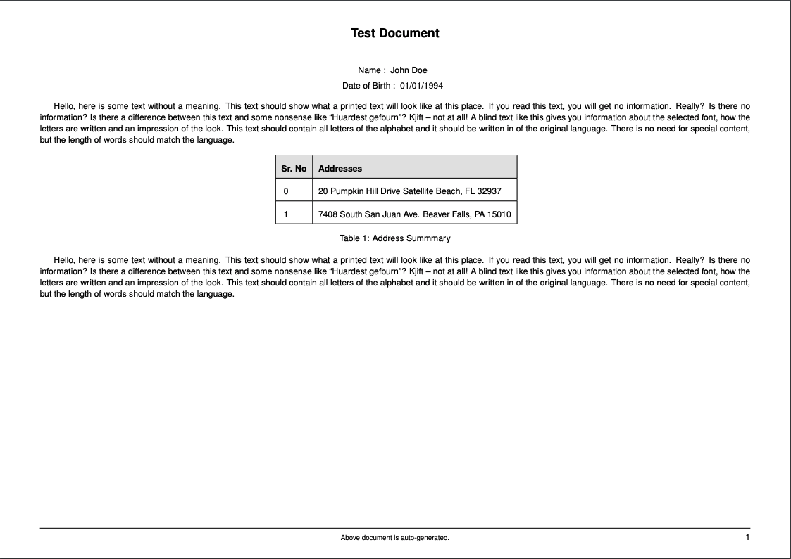

# A laravel package to generate pdfs using latex

    
    

LaTex is an extraordinary typesetting system, using which you can highly professional and clean documentation. The document can be a simple article or huge technical/scientific book.

The reason to choose LaTex is that, it has extensive features inbuilt have headers, footers, book index, page numbers, watermarks and so on... Once you explore the possibilities of a LaTex document, you would be amazed.

This package makes entire scaffolding using which you can generate, save or download PDF documents.

## Pre-requisites : 

You need to have `texlive-full` program installed on your server. This program has tex packages and language libraries which help you generate documents.

Note : You can also opt to install `textlive` which is the lighter and primitive version of the package where as `texlive-full` contains all package bundles. 

The different is : 
    - When you install `textlive` and want to use any additional tex package, you need to install it manually. 
    - `texlive-full` comes with these extra packages. As a result it may take up some additional space on server (to store the package library files).

## Installation : 

~~~bash
composer require techsemicolon/laravel-php-latex
~~~

## Dry Run : 

Before diving into the usage directly, it is important to make sure required programms are installed properly on yoru server. The package comes with dryrun method which you can use in put inside any controller or route. It will automatically generate `dryrun.pdf` if everything is set up prperly on the server. If not, it will throw `LatexException` with detailed server errors.

~~~php
<?php

namespace App\Http\Controllers;

use App\Http\Controllers\Controller;
use Techsemicolon\Latex;

class TestController extends Controller
{
    /**
     * Download PDF generated from latex
     * 
     * @return Illuminate\Http\Response
     */
    public function download(){

        return (new Latex)->dryRun();
    }
}
~~~

Dryrun will download a beautifully clean test pdf like below : 

    

## Usage : 

- Create a view file with tex data : 

Create a view files inside `resources/views/latex/tex.blade.php`

~~~tex
\documentclass[a4paper,9pt,landscape]{article}

\usepackage{adjustbox}
\usepackage[english]{babel}
\usepackage[scaled=.92]{helvet}
\usepackage{fancyhdr}
\usepackage[svgnames,table]{xcolor}
\usepackage[a4paper,inner=1.5cm,outer=1.5cm,top=1cm,bottom=1cm,bindingoffset=0cm]{geometry}
\usepackage{blindtext}
\geometry{textwidth=\paperwidth, textheight=\paperheight, noheadfoot, nomarginpar}

\renewcommand{\familydefault}{\sfdefault}

\pagestyle{fancy}
\fancyhead{}
\renewcommand{\headrulewidth}{0pt}
\fancyfoot{}
\fancyfoot[LE,RO]{\thepage}

\fancyfoot[C]{\fontsize{8pt}{8pt}\selectfont Above document is auto-generated.}
\renewcommand{\footrulewidth}{0.2pt}

\begin{document}

\section*{\centering{Test Document}}

\begin{center}
    \item[Name :] {{ $name }}
    \item[Date of Birth :] {{ $dob }}
\end{center}

\blindtext

\begin{table}[ht]
\centering
\begin{adjustbox}{center}
\renewcommand{\arraystretch}{2}
\begin{tabular}{|l|l|}

\hline

\rowcolor[HTML]{E3E3E3}
\textbf{Sr. No} 
& \textbf{Addresses}\\
\hline

@foreach($addresses as $key => $address)

    \renewcommand{\arraystretch}{1.5}
    {{ $key }} & {{ $address }} \\
    \hline

@endforeach

\end{tabular}
\end{adjustbox}
\caption{Address Summmary}
\end{table}

\blindtext

\vfill
\centering

\end{document}
~~~

You can see how we have easily used blade directives for {{ $name }} or @foreach to show addresses in table to dynamically generate the content.

-  Generate the file : 

There are few actions you can choose take to generate. 

1. You can download the file as a response :

~~~php
<?php

namespace App\Http\Controllers;

use App\Http\Controllers\Controller;
use Techsemicolon\Latex;

class TestController extends Controller
{
    /**
     * Download PDF generated from LaTex
     * 
     * @return Illuminate\Http\Response
     */
    public function download(){

        return (new Latex('latex.tex'))->with([
            'name' => 'John Doe',
            'dob' => '01/01/1994',
            'addresses' => [
                '20 Pumpkin Hill Drive Satellite Beach, FL 32937',
                '7408 South San Juan Ave. Beaver Falls, PA 15010'
            ]
        ])->download('test.pdf');
    }
}
~~~

2. You can save pdf to the location you want for later use :

~~~php
(new Latex('latex.tex'))->with([
    'name' => 'John Doe',
    'dob' => '01/01/1994',
    'addresses' => [
        '20 Pumpkin Hill Drive Satellite Beach, FL 32937',
        '7408 South San Juan Ave. Beaver Falls, PA 15010'
    ]
])->savePdf(storage_path('exports/pdf/test.pdf'));
~~~

3. You can just render the tex without generating a pdf :

~~~php
$tex = new Latex('latex.tex'))->with([
    'name' => 'John Doe',
    'dob' => '01/01/1994',
    'addresses' => [
        '20 Pumpkin Hill Drive Satellite Beach, FL 32937',
        '7408 South San Juan Ave. Beaver Falls, PA 15010'
    ]
])->render();
~~~
## Setting up custom bin path : 

If your server is not having `pdflatex` in the environment `$PATH`, you might need to give full path to execute the command. To find the path you can do :

~~~bash
which pdflatex
~~~

Then you can pass that path using `binPath` function as below : 

~~~php
return (new Latex('latex.tex'))->with([
    'name' => 'John Doe',
    'dob' => '01/01/1994',
    'addresses' => [
        '20 Pumpkin Hill Drive Satellite Beach, FL 32937',
        '7408 South San Juan Ave. Beaver Falls, PA 15010'
    ]
])->binPath('/usr/bin/pdflatex')->download('test.pdf');
~~~

## Using Raw Tex : 

If you do not want to use views as tex files, but already have tex content. Or are using other libraries to generate tex content like [Markdown-to-LaTex](https://github.com/cebe/markdown-latex), you can use `RawTex` class instead of passing a view path : 

~~~php 
$tex = new RawTex('your_raw_tex_content_string.....');

return (new Latex($tex))->with([
    'name' => 'John Doe',
    'dob' => '01/01/1994',
    'addresses' => [
        '20 Pumpkin Hill Drive Satellite Beach, FL 32937',
        '7408 South San Juan Ave. Beaver Falls, PA 15010'
    ]
])->download('test.pdf');

~~~

## Bulk download in a zip archive : 

Want to expot multiple pdfs in zip? Package has that functionality ready for you. This gives a great flexibility for you. However, make sure you are not passing too many pdfs together, as it is going to consume good amount server memory to export those together.

~~~php 
$latexCollection = (new LatexCollection());
$users = User::limit(10)->get();
foreach ($users as $user) {
            
    $pdfName = $user->first_name.'-'.$user->last_name.'-'.$user->id.'.pdf';

    // Create latex instance
    $latex = (new Latex('latex.patientsummary'))->with([
        'user' => $user
    ])->setName($pdfName);

    // Add it to latex collection
    $latexCollection->add($latex);
}

// Download the zip
return $latexCollection->downloadZip('bulk.zip');

// OR you can also save it 
$latexCollection->saveZip(storage_path('exports/zips/users.zip'));
~~~

## Listening to events : 

Whenever a pdf is succesfully generated, it fires an event `LatexPdfWasGenerated`. Similarly whenever if pdf generation fails, it fires event `LatexPdfFailed`.

These events are important if you need to perform some actions depending on the generation stutus like updating the database. But mostly these pdf have some metadata like which user the pdf belongs to or which order the pdf belongs to. You can pass this metadata while instantiating `latex` as a second argument.

This metadata is then passed back to you from the fired event, which makes it much more meaningful to listen. The metadata can be anything, if can bt string, numeric, an array, object, collection etc. You can pass the metadata depending on your desired logic.

~~~php
// $user will be our metadata in this example
$user = Auth::user();

(new Latex('latex.tex', $user))->with([
    'name' => 'John Doe',
    'dob' => '01/01/1994',
    'addresses' => [
        '20 Pumpkin Hill Drive Satellite Beach, FL 32937',
        '7408 South San Juan Ave. Beaver Falls, PA 15010'
    ]
])->savePdf(storage_path('exports/pdf/test.pdf'));
~~~

Then you can define a listener like : 

~~~php
<?php

namespace App\Listeners;

use Techsemicolon\LatexPdfWasGenerated;

class LatexPdfWasGeneratedConfirmation
{
    /**
     * Create the event listener.
     *
     * @return void
     */
    public function __construct()
    {
        //
    }

    /**
     * Handle the event.
     *
     * @param  LatexPdfWasGenerated  $event
     * @return void
     */
    public function handle(LatexPdfWasGenerated $event)
    {
        // Path  of pdf in case in was saved 
        // OR 
        // Downloaded name of pdf file in case it was downloaded in response directly
        $pdf = $event->pdf;

        // download OR savepdf
        $action = $event->action;

        // metadata $user in this example
        $user = $event->metadata;

        // Perform desired actions
    }
}
~~~

## Garbage Collection : 

When you export the pdf, few extra files are generated by `pdflatext` along with it e.g. `.aux`, `.log` etc. The package takes care of the garbage collection process internally. It makes sure no residual files are remaining when pdf is generated or even when any error occures.

This makes sure the server does not waste it's space keeping the residual files.

## Error Handling :

We are using `pdflatex` program from `texlive` to generate pdfs. If error a syntax occures in your tex file, it logs into a log file. Or it is turned off, it shows output in console.

The package takes care of the same internally and throws much `ViewNotFoundException`. The exception will have entire information about the error easily available for you to debug.

Please feel free to contribute if you want to add new functionalities to this package.

## License : 

This psckage is open-sourced software licensed under the MIT license
